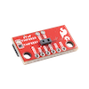

# TMF882X


[](https://hex.pm/packages/tmf882x)
[](https://hexdocs.pm/tmf882x)

This library interfaces with [TMF8820](https://ams.com/en/tmf8820) (and theoretically [TMF8821](https://ams.com/en/tmf8821)) multi-zone Time-of-Flight (ToF) sensors. From the manufacturer:

> The TMF8820 is a direct time-of-flight (dToF) sensor in a single modular package with associated VCSEL. The dToF device is based on SPAD, TDC and histogram technology and achieves 5000 mm detection range. Due to its lens on the SPAD, it supports 3x3 multizone output data and a wide, dynamically adjustable, field of view. A multi-lens-array (MLA) inside the package above the VCSEL widens up the FoI (field of illumination). All processing of the raw data is performed on-chip and the TMF8820 provides distance information together with confidence values on its I2C interface.

A breakout board is available from [SparkFun](https://www.sparkfun.com/products/19218) among others.



Details about the device and many of the configuration options can be found in the appropriate [datasheet](https://ams.com/documents/20143/6015057/TMF882X_DS000693_5-00.pdf)

## Installation

Add `tmf882x` to your list of dependencies in `mix.exs`:

```elixir
def deps do
  [ {:tmf882x, "~> 0.1"} ]
end
```

## Usage

Start a `TMF882X` it directly from another process (See Options section below for more info):

```elixir
{:ok, pid} = TMF882X.start_link(bus: "i2c-1")
```
The TMF882X process will handle the initialization and initial configuration of the device. You 
can check the status of the  device and application.

* **`app_ready?()`** - returns `true` after the measurement app has been written to the device.
                       Calling `start_measuring/1` when app_ready is true will start taking measurement.
                       
* **`running?()`** - returns `true` if the measurement app is running and actively taking measurements.
                    Controlled by the `start_measuring/1` and `stop_measuring/1` functions.

```elixir
iex> TMF882X.app_ready?(pid)
true

iex> TMF882X.running?(pid)
true
```

### Configuration 

A configuration keyword list can be passed to the `start_link` function containing the following parameters:

* **`bus`** - Name of the I2C bus that the sensor is attached to.

* **`interrupt_gpio`** - If the interrupt pin of the sensor is connected, the GPIO number can be specified here.  If not interrupt
                pin is specified, then the library will use I2C to poll when a new measurement packet is ready.

* **`enable_gpio`** - If the enable pin is connected, the GPIO number can be specified here. If connected, calling `reset/1` will
                use this pin to reset the device.  Otherwise, I2C commands will be issued to reset the device. (default: `nil`)

* **`auto_start`** - If set to `true`, the device will immediately start taking measurements once the `app_ready` status is `true`.
                    If set to `false`, the device will wait for a call to `start_measuring/1` before taking any measurements. (default: `true`)

* **`measure_interval`** - Target interval (in milliseconds) between measurements.  If set to `0`, as soon as a measurement is received, another
                          will start.
* **`device_config`** - The configuration to be sent to the device on startup.  See Configuration section below.

### Results

The calling process will receive messages of the format `{:tmf882x, %TMF882X.Result{}}`:

```elixir
def handle_info({:tmf882x, %TMF882X.Result{} = result}) do
  ...
end
```

The `TMF882X.Result` struct contains a list of measurements from each channel.  Each measurement is a tuple containing a `distance` (in millimeters) and `confidence` (out of 255) value:

```elixir
%TMF882X.Result{
  tid: 200,
  size: 128,
  number: 200,
  temperature: 41,
  valid_results: 11,
  ambient: 283,
  photon_count: 16971,
  reference_count: 60573,
  sys_tick: 1215866837,
  measurements: [
    {844, 61},
    {841, 106},
    {1010, 56},
    ...
  ]
}
```

Other fields in the `Result` struct are directly from the decode of the Result register.

## Device Configuration

Each configuration item specified in the configuration register is represented and can be read, though only
some are currently implemented to be written to the device (`period` and `spad_map_id`).

```elixir
iex> TMF8820.get_config(pid)
%{
  alg_setting_0: %{distances: true, logarithmic_confidence: false},
  confidence_threshold: 6,
  gpio_1: %{driver_strength: 0, gpio: 0, pre_delay: 0},
  gpio_2: %{driver_strength: 0, gpio: 0, pre_delay: 0},
  hist_dump: false,
  i2c_addr_change: 0,
  i2c_slave_address: 65,
  int_persistence: 0,
  int_threshold_high: 65535,
  int_threshold_low: 0,
  int_zone_mask_0: 0,
  int_zone_mask_1: 0,
  int_zone_mask_2: 0,
  kilo_iterations: 537,
  osc_trim_value: 508,
  period: 33,
  power_cfg: %{
    allow_osc_retrim: false,
    goto_standby_timed: false,
    keep_pll_running: false,
    low_power_osc_on: false,
    pulse_interrupt: false
  },
  spad_map_id: 1
}

iex> TMF8820.apply_config(%{spad_map_id: 3})
:ok
```

## SPAD Configuration

The TMF8820 and TMF8821 come with a set of built-in SPAD maps. Drawings and considerations for these can be found in the datasheet.  Each of these devices also supports a custom SPAD map that can be written to the device at runtime and selected by setting the `spad_map_id` to 14.

Creating a custom SPAD map is not a trivial task and requires following a set of rules specified in the datasheet.  There are a few SPAD map examples in the SPAD.md file in this repo.


```elixir
custom_spad = %{
      x_offset: 0,
      y_offset: 0,
      x_size: 14,
      y_size: 6,
      mask: [
        [0, 0, 0, 0, 0, 0, 0, 0, 0, 0, 0, 0, 0, 0, 0, 0, 0, 0],
        [0, 0, 0, 0, 0, 1, 1, 1, 1, 0, 0, 0, 0, 0, 0, 0, 0, 0],
        [0, 0, 0, 0, 0, 1, 1, 1, 1, 0, 0, 0, 0, 0, 0, 0, 0, 0],
        [0, 0, 0, 0, 0, 1, 1, 1, 1, 0, 0, 0, 0, 0, 0, 0, 0, 0],
        [0, 0, 0, 0, 0, 1, 1, 1, 1, 0, 0, 0, 0, 0, 0, 0, 0, 0],
        [0, 0, 0, 0, 0, 0, 0, 0, 0, 0, 0, 0, 0, 0, 0, 0, 0, 0],
        [0, 0, 0, 0, 0, 0, 0, 0, 0, 0, 0, 0, 0, 0, 0, 0, 0, 0],
        [0, 0, 0, 0, 0, 0, 0, 0, 0, 0, 0, 0, 0, 0, 0, 0, 0, 0],
        [0, 0, 0, 0, 0, 0, 0, 0, 0, 0, 0, 0, 0, 0, 0, 0, 0, 0],
        [0, 0, 0, 0, 0, 0, 0, 0, 0, 0, 0, 0, 0, 0, 0, 0, 0, 0]
      ],
      map: [
        [0, 0, 0, 0, 0, 0, 0, 0, 0, 0, 0, 0, 0, 0, 0, 0, 0, 0],
        [0, 0, 0, 0, 0, 2, 2, 2, 2, 0, 0, 0, 0, 0, 0, 0, 0, 0],
        [0, 0, 0, 0, 0, 4, 4, 4, 4, 0, 0, 0, 0, 0, 0, 0, 0, 0],
        [0, 0, 0, 0, 0, 6, 6, 6, 6, 0, 0, 0, 0, 0, 0, 0, 0, 0],
        [0, 0, 0, 0, 0, 8, 8, 8, 8, 0, 0, 0, 0, 0, 0, 0, 0, 0],
        [0, 0, 0, 0, 0, 0, 0, 0, 0, 0, 0, 0, 0, 0, 0, 0, 0, 0],
        [0, 0, 0, 0, 0, 0, 0, 0, 0, 0, 0, 0, 0, 0, 0, 0, 0, 0],
        [0, 0, 0, 0, 0, 0, 0, 0, 0, 0, 0, 0, 0, 0, 0, 0, 0, 0],
        [0, 0, 0, 0, 0, 0, 0, 0, 0, 0, 0, 0, 0, 0, 0, 0, 0, 0],
        [0, 0, 0, 0, 0, 0, 0, 0, 0, 0, 0, 0, 0, 0, 0, 0, 0, 0]
      ]
    }

# You must change the spat_map_id before setting the custom spad
:ok = TMF882X.apply_config(pid, %{spad_map_id: 14})
:ok = TMF882X.set_spad(pid, custom_spad)
```


## Future Work

* Calibration and uploading of calibration data.
* Configurable device I2C addresses for communicating with more than one device on the same bus.
* Testing with a TMF8821
